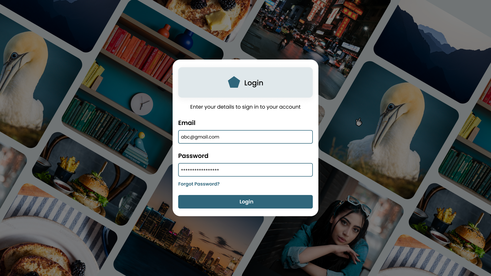
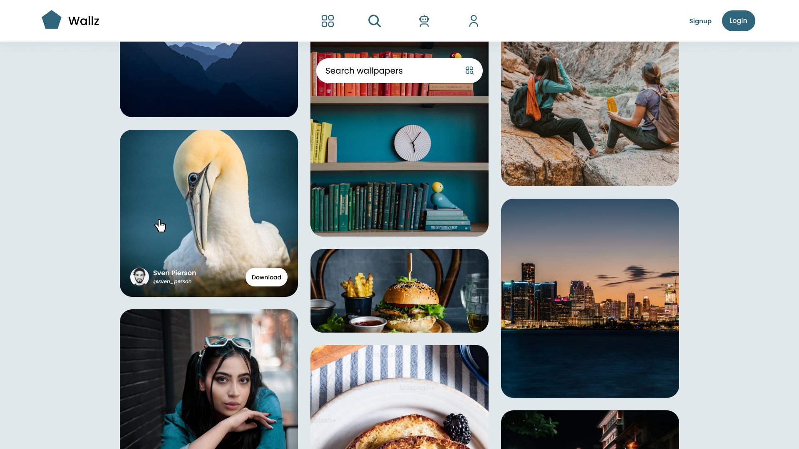
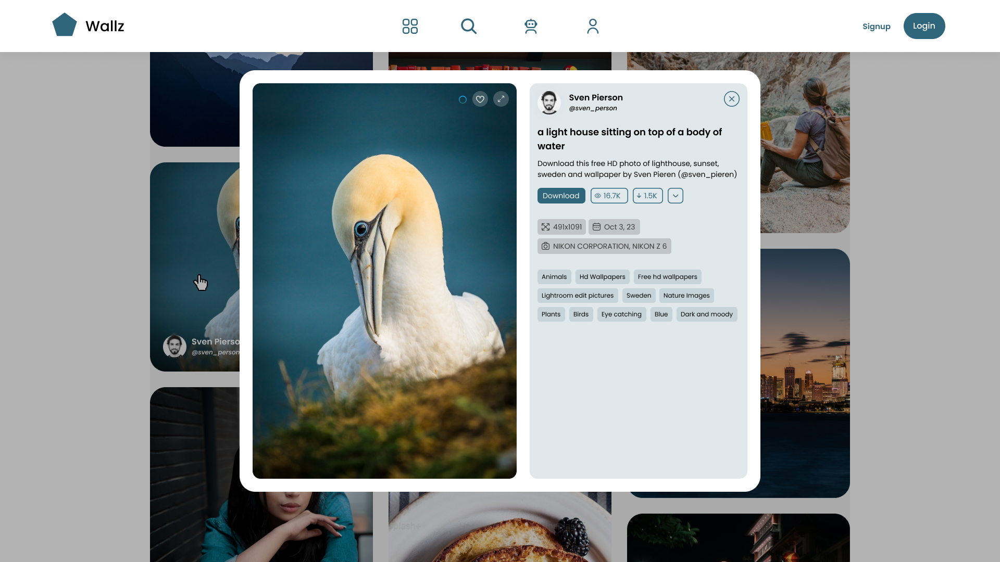
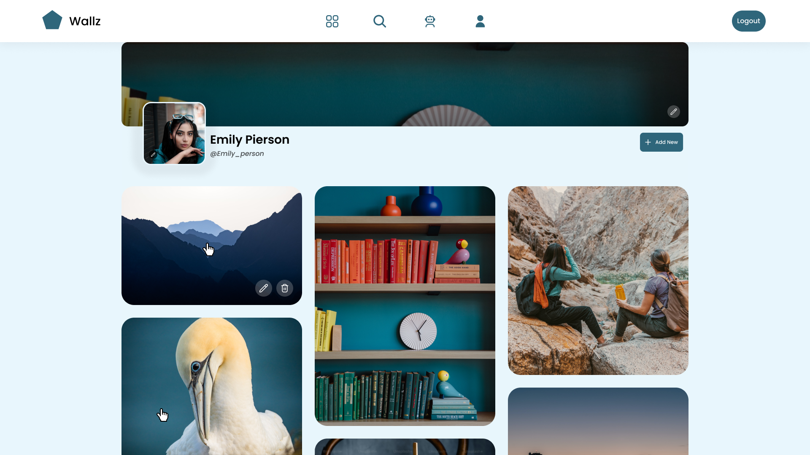
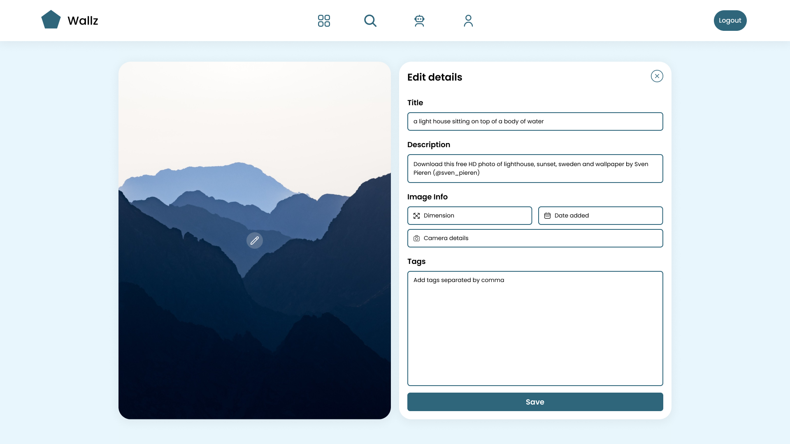

# Wallpaper Hub - Laravel

## Description

Wallpaper Hub is a feature-rich web application developed using the Laravel framework, designed exclusively for users who appreciate high-quality wallpapers. The application provides a seamless experience for users to access, download, and search for wallpapers. Additionally, users can create accounts to upload their own wallpapers, enabling them to perform CRUD (Create, Read, Update, Delete) operations on their uploaded content.

### User Side
- Access a vast collection of wallpapers curated for diverse preferences.
- Download wallpapers to personalize their devices.
- Effortlessly search for wallpapers based on categories, tags, or keywords.
- Create an account to unlock additional features and manage their favorite wallpapers.
- Upload, modify, and delete their own wallpapers to contribute to the community.

## Technology Stack

- Laravel for the core application logic and backend functionality.
- MySQL for managing the database and handling data.
- Unsplash API for fetching high-quality pictures and wallpapers.
- MediaQuery for responsive and visually appealing frontend design.

## Installation

1. Clone the repository to your local machine.
2. Install Composer dependencies using the following command:

```bash
composer install
```

3. Configure the database settings in the `.env` file.
4. Migrate and seed the database:

```bash
php artisan migrate --seed
```

5. Set up an account on Unsplash and obtain an API key.
6. Update the Unsplash API key in the `.env` file.

```env
UNSPLASH_API_KEY=your_unsplash_api_key
```

## Usage

1. Launch the application using a local development server:

```bash
php artisan serve
```

2. Visit the provided URL in your web browser.
3. Explore the extensive collection of wallpapers without the need for an account.
4. Create an account to access additional features like uploading, modifying, and deleting wallpapers.
5. Search for wallpapers using the intuitive search functionality.
6. Contribute to the community by uploading your own high-quality wallpapers.

## Note

1. Ensure that Composer and Laravel dependencies are installed on your machine.
2. A valid Unsplash API key is required for fetching wallpapers. Update the key in the `.env` file.
3. The application is designed to run on a local development server for testing and exploration.
4. Adjust the storage permissions and configurations if necessary.

## User Interface






